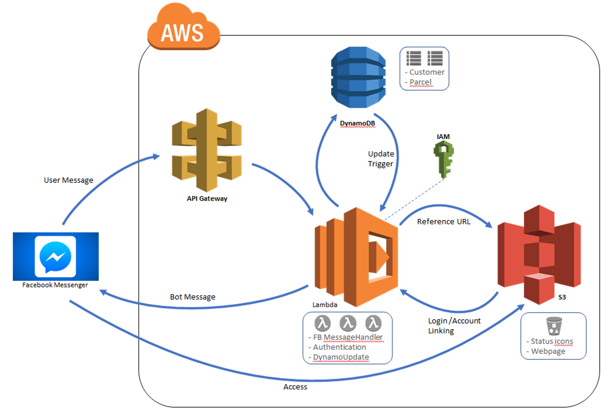

# AWS Infrastructure

## Overview

In our innovation lab we use a function as a service (FaaS) approach to operate the Facebook messenger bot.
With approach the functionality of the bot will be deployed without any obvious infrastructure. Only the function code will be deployed and is ready to used.
Therefore, we benefit with a very high scalability and low costs.

We chose AWS in our innovation lab to provide this infrastructure. For that we use the following components:

* AWS Lambda: With AWS Lambda we provide the business logic of the messenger bot.
* AWS IAM: With the AWS Identity and Access Management (IAM) we have to define the correct roles and policies to create and run the bot.
* AWS API Gateway: The AWS API Gateway will be used to provide a REST service which calls the lambda function of the bot.
* DynamoDB: The database is used to store the customers and status of the parcels.
* S3: In S3 we provide images and an authentication webpage for public access.

The following picture gives an overview on the used AWS components:

](aws_components_overview.png "AWS components overview")

## Infrastructure setup

To not manually setup all the AWS components or with IaC scripts by ourselves, we use the tooling [claudia.js](https://github.com/claudiajs/claudia).

This tooling makes it very easy to set up node.js based lambda functions which will be accessible via the AWS API Gateway.

## Components

- [AWS IAM](./aws_iam.md)
- [AWS API Gateway](./aws_api_gateway.md)
- [AWS Lambda](./aws_lambda.md)
- [AWS DynamoDB](./aws_dynamodb.md)