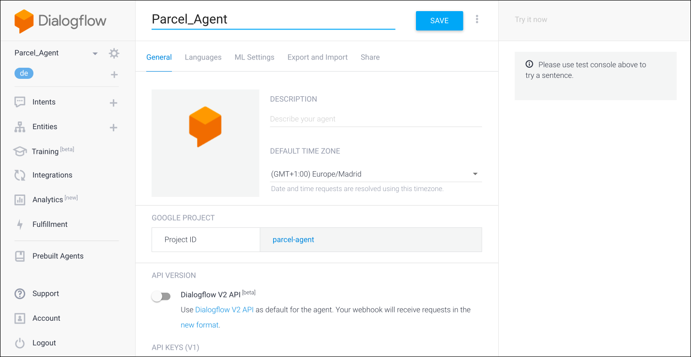
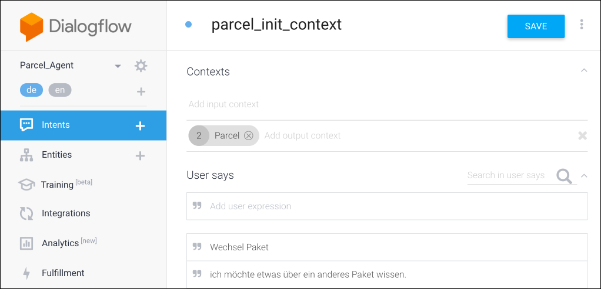
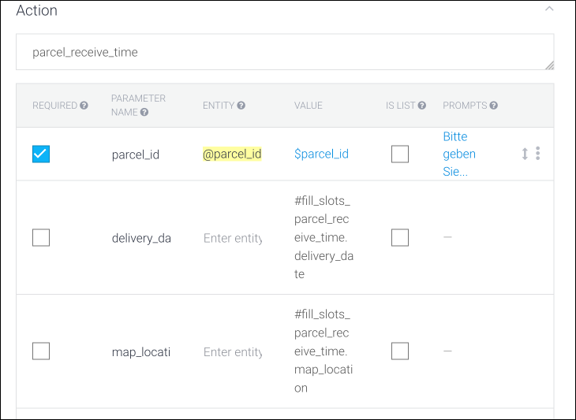
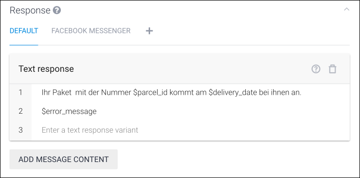
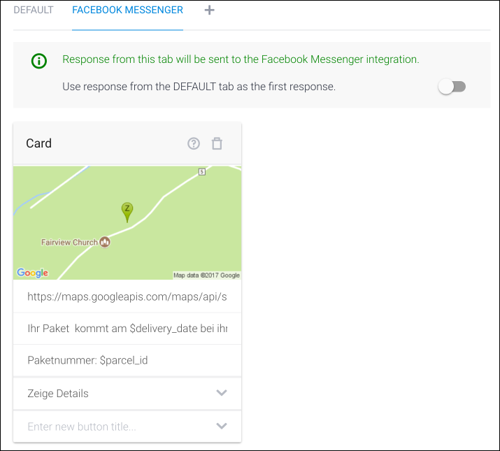
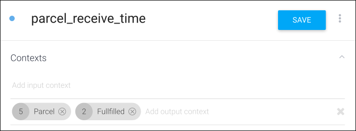
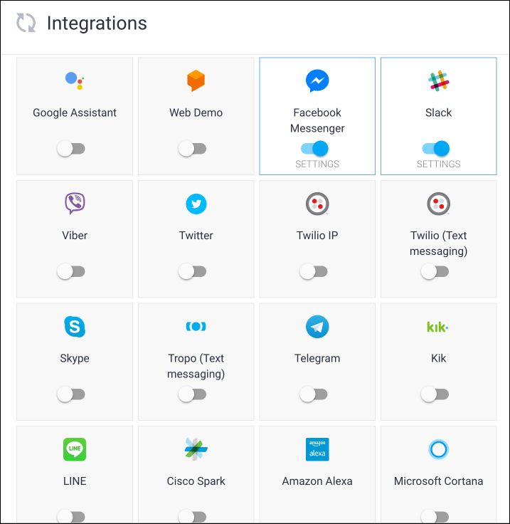

# Dialogflow

Dialogflow by Google is more feature rich than wit.ai. It provides a conversational state and therefore allows dialog communication between the user and the Dialogflow agent.
Dialogflow exchanges messages to some messenger directly. In addition to Facebook messenger it supports Slack, Alexa and many others.
Since Dialogflow handles the conversation itself, it either recognizes an 'intent' or it does not (and provides a default respsone).
Within an 'intent' there can exist 'entities'. Those are business values that must be provided by the user.
The 'entities' can be stored in a 'context' to be available for the next 'intent'.

Beside the integration into Facebook, Dialogflow has a huge number of supported messenger platforms, most important are:
* Facebook
* Google Assistant
* Amazon Alexa (Dialogflow  
* Slack

This descriptions gives an impression and summary about Dialogflow. For more information you have to read the [Dialogflow Documentation](https://dialogflow.com/docs/intents).

## Concepts

The idea of Dialogflow is to design dialogs with the customer to give him the impression of a natural chat with the customer care agent.
For this reason, Dialogflow provides a lot of build-in features to design such experience. These features are:

* NLP features learn from given sentences and identify intents and information from the user sayings
* Structured dialogs, where Dialogflow can perform a question and answer sessions for mandatory attributes without any further implementation
* Direct support of stored context information for a certain time or request count
* Followup intents which could be a direct answer to an intent
* Default intents which can be used if the answer is not understandable
* Multiple responses to give the dialog a little more variance

The development of a bot using Dialogflow is slightly different as the bot development by yourself or using tool like claudia bot builder.
In this case the main webhook which will be used by Facebook will be the Dialogflow agent itself. The agent is running inside the Google Cloud and will be configured via a web console.
The main communication will be done via Facebook Messenger and Dialogflow. Only if an "intent" is fulfilled and all necessary information has been collected the lambda containing the businesslogic will be called. In our case the lambdas and the database is inside the AWS Cloud.

### Agent

The [Agent](https://dialogflow.com/docs/agents) in Dialogflow is the actual Facebook Messenger bot. The Agent can be understood as a NLU (Natural Language Understanding).
For that it contains all building blocks to create a dialog flow like:
* Entities
* Intents
* Actions and parameter
* Fulfillments (webhook)
* etc.

The Agent will be integrated into the Facebook Messenger. Here you see the Web Console where to define your Agent:

#### Language

Dialogflow supports [multiple languages](https://dialogflow.com/docs/multi-language). For that reason you have do defined in the Agent which languages will be supported by your Agent.

In your console, you have to swith between the language you had configured and you want to develop and test:

The user-sayings and prompts, defined in the intents, are influenced by this decision.

#### Share: User and Roles

In the Agent you can define a list of users which are allowed to work on this agent.
The user can have different roles regarding their need. These roles are available:
*  **Admin**: Only the creator of the Agent can be Admin.
*  **Developer**: Has the rights to change and develop the agent
*  **Reviewer**: Can review and test the Agent

### Entities

The entities define the information which should be extracted form the natural language of the message.
In Dialogflow you can define entities for all needed structured information. Three different types are defined in Dialogflow:

1. System-Entities: Build-in entities by Dialogflow to handle to most popular information. (e.g.: sys.date = Datum)
2. Developer-Entities: Entities wich will be defined by the developer and are available for all his agents.
3. User-Entities: User entities can be redefined on a session ID level, allowing for specific concepts, like a user's playlists.

### Intent

An [intent](https://dialogflow.com/docs/intents) represents a mapping between what a user says and what action should be taken by your software.

Intent interfaces have the following sections:

- User says
- Action
- Response
- Contexts
- Events

#### User says

The "User says" are the expressions which will be used to match an intent by a user's message. The can be defined as examples in natural language (Example mode ") or as Template (Template mode @).
It is recommended use the example mode because it is more easy to train the machine learning.

In the sentence of the user says you are able to add or mark the entities. They will be used as structured input for actions or responses.

#### Actions

The action defines what will be done inside the application, it contains a action name and a list of parameter.

The **Action-Name** can be defined by the customer. It will be used to decide which code will be called inside the application.
Therefore a single action name can be used by multiple intents.

The **Parameter** can be defined manually or automatically outside the "user says". These options can be defined for a parameter.

* Required: Determine if a Parameter is require. If a parameter is required and not available, one of the defined prompts will be displayed to receive this parameter value.
* Parameter Name: The name of the parameter as it will be send to the action and how it can be used in the response template.
* Entity: If a parameter will be added by the used, there has to be a corresponding entity.
* Value: From which place the value will be received, this could be the user input, or from an event or context.
* Is List: Indicated of the delivered content is a list.
* Prompts: A list of prompts to ask the user for the missing information.
* Default Value: If no content can be found at the "Value" place, the default value can be received from another location or can be a fixed value. (e.g. If the user do not prompt an require imput, it can be received from the context)

#### Response

In the response section, the output can be defined. Due to the active integration more than one tab can be available.
The fist tab is the default response which could be a "Text response" of a custom payload as json format.

Inside the response you can use the [defined parameters as variables](https://dialogflow.com/docs/intents#text_response).

**Caution**: You my get problems if you want to handle to complex properties. In this case to must define them at your properties section in a more flatten way. (e.g. #statuslist.transport.description => #status_transport.description)

If you have optional parameter or parameter like error messages, you can define multiple responses which uses the different combination of parameters. Due to the available Parameter, it will only display the fitting response.

You can add "Rich Messages" which are specific for the integration and contain some predefined templates like:
* Cards
* Buttons
* Texts
* Images
* Custom Payload

#### Contexts

A [context](https://dialogflow.com/docs/contexts) will be used to hold a state between the conversations. Therefore a context can hold a list of parameter for a certain lifespan.
A context can be the output result (Output-Context) of an intent or a input requirement (Input-Context). While the lifespan of the context it is available in every intent or webhook call.
The stored Parameter of an event can be available with _#event.parameter_.

**Input Context**

If you define a Context as Input-Context, the intent will only be called if this context is available. This could be used to create followup intents.

**Output Context**

If an Output-Context is defined, all current parameters will be stored in this context. If the context is already available, the lifespan will be resetted and the parameters will be enrichted.

**Deleting Context**

You can delete a context by setting it lifespan to 0.

#### Events

Events can be used as alternative way to call this intent. Only one intent at a time can be registered for one event. An event can contain data which will be availabile as parameter over _#event.parameter_.

An event can be fired by your app over the REST API or as followup event over the webhook.

#### Fullfillment activation

Here you can activate the call of the defined webhook. To do that there are two options:
* **Use webhook**: This option just calls the webhook after the intent is completed and all necessary required parameter are collected.
* **Use webhook for slot-filling**: With this option the webhook will be called everytime the intent is called.

### Fulfillment:

In Dialogflow you are able to configure a so called "[fulfillment](https://dialogflow.com/docs/fulfillment)" option. With this option you can add a webservice call for an external REST-Service (in our case AWS Lambda via API-Gateway) or lambda functions, hosted at Google.

You can just add one webservice destination, which means that this has to be a invocation handle which routes the call by its action name to the actual implementation.

To enable the fulfillment call in the intents you have to activate them in the intents.

### Integration

In the integration section you can add the integration with which your dialogflow agent should work.
Each integration has it's onw settings. If you activate them, the specific response type will be available.

For Facebook you have to perform the following actions to integrat the agent:
1. Create and teach a conversational bot for Facebook Messenger.
2. After you design and test your Dialogflow agent, you can launch your Messenger bot

   1. Get your Facebook Page Access Token and insert it in the field below.
   2. Create your own Verify Token (can be any string).
   3. Click 'START' below.
   4. Use the Callback URL and Verify Token to create an event in the Facebook Messenger Webhook Setup.

## Specific development usecases

### Render Content result with dialogflow after fulfillment

tbd

### Link facebook

tbd

## Pricing

Dialogflow is available in two editions: standard and enterprise. While the standard edition is free of any charge, for the enterprise edition you get charged on a per request basis. In return, it has a higher throughput (10 instead of 3 queries per second) and comes with an SLA. It is possible to increase the quota even more on request. However, the enterprise edition is based on the new Dialogflow V2 API which is currently in beta phase.

| Features | Standard Edition | Enterprise Edition |
| --- | --- | --- |
| Text Interaction | Free usage with unlimited requests | Unlimited requests at $0.002 per request |
| Voice Interaction | Free usage up to 1,000 requests per day with a maximum of 15,000 requests per month | Unlimited Google Cloud Speech requests at $0.0065 per request |
| Default quota for text queries | 3 queries per second (averaged over a minute) |10 queries per second (averaged over a minute) |
| Service Level Agreement | None | Coming soon (with the v1 GA release) |
| Support | Community support and via email | Eligible for Cloud Support packages with committed response times for supporting production applications |
| Terms of Service | Dialogflow ToS | Google Cloud Platform ToS |

## Problems During Development

 - Alle arbeiten an einem Lambda
 - Es kann aber immer nur eine Version deployed werden
 - Mehrere Versionen deployen funkioniert nicht, da wir dann auch mehrere DialogFlow Agents bräuchten
 - Ein Main Lambda und mehrere Intent-Lambdas würde das Problem lösen (was allerdings nur ein Problem aus der Entwicklung ist und nicht Produktionsrelevant. Im Gegenteil, zusätzliche Latency durch Lambda-Aufruf.)
 - Wie werden Daten aus einen Lambda als zum füllen der Varriablen zurück gegeben.
 - Wie kann man Intents schreiben die mit und ohne Context umgehen können?
 - Wie unterdrückt man ausgaben wenn eine Fehler zurück gegeben wird.
 - Keine möglichkeit Abfragen in die Antworten von Dialogflow zu geben.
 - Spezialevents wie Account Linking können nicht behandelt werden. 
