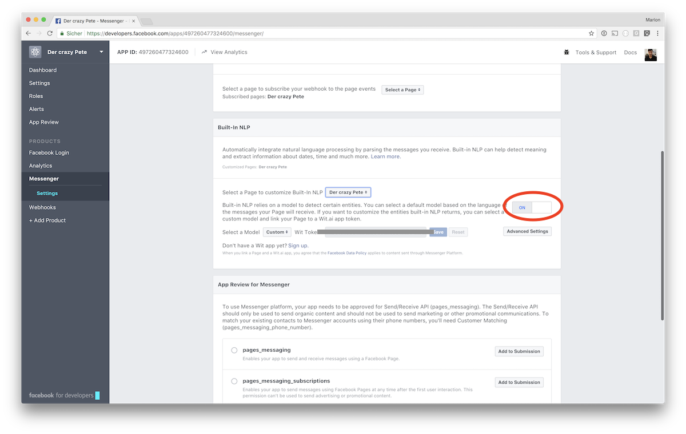
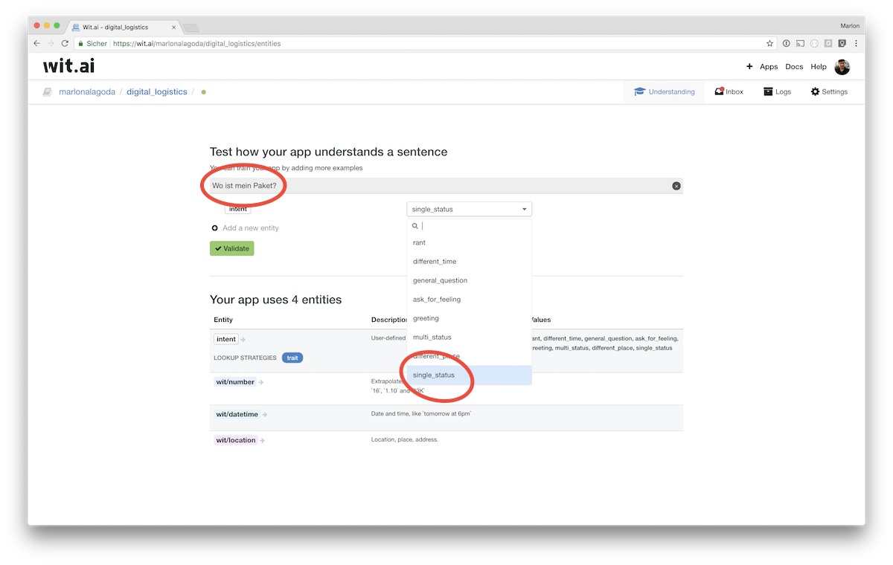
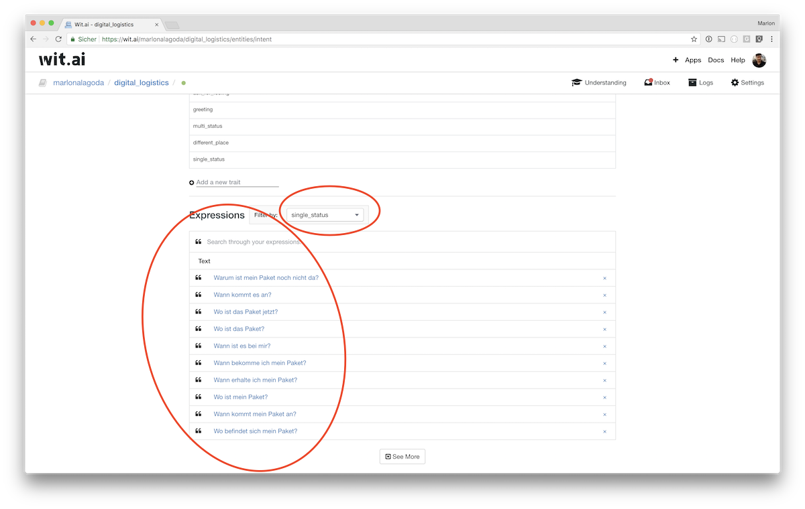
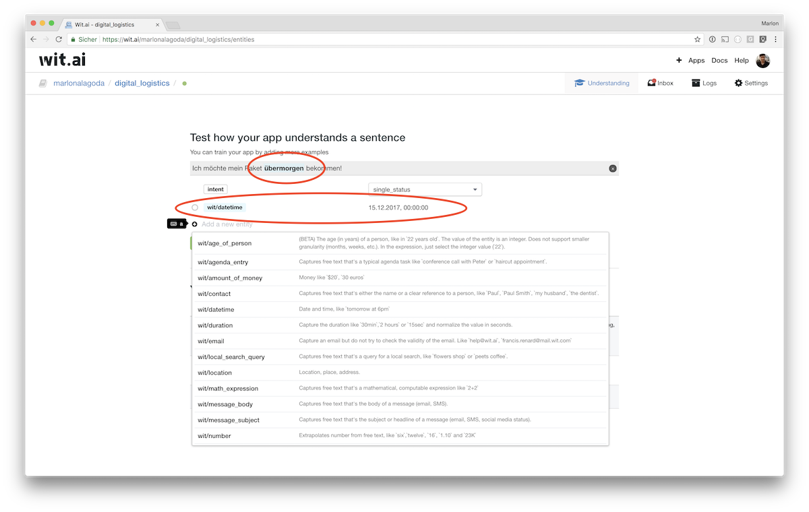
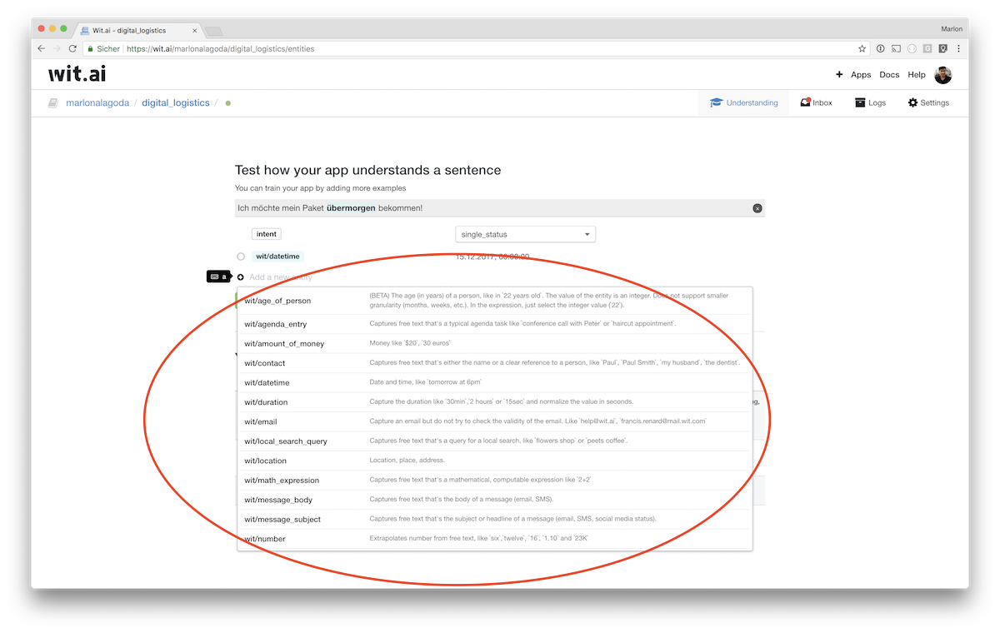

# Wit.ai

Wit.ai is a Natural Language Processing Software as a Service by Facebook. It parses and understands sentences written by humans and provides your application possible user intents such as "Is hungry" or "Wants to meet" as well as so called entities, such as a date information, a number or a location, which can be found in the user input. Find more about NLP tools in general in [our overview](https://github.com/senacor/InnoLabFacebookMessenger/tree/master/docs/facebook_chatbot_with_ai).

## How to use Wit.ai

We enabled Wit as message proxy at the Facebook developer console for our Facebook app. By doing that our application not only receives the user's message but also the result of Wit's language processing.


Alternatively Wit can be used via a [REST service](https://wit.ai/docs/http/20170307).

## How to configure and train Wit.ai

Possible intents are defined by us, Wit rates each intent by calculating a so called confidence-value. Our application discards all but the intent with the highest confidence!

To train Wit recognizing your intents you need to provide example sentences for each intent.



For the intent `single_status` we provided Wit with the following example sentences.



Wit then also recognizes similar sentences it got not trained with like "Wann wird das Paket denn bei mir sein?" as `single_status` intent.

In addition to intents, Wit can also extract so called entities.



In contrast to intents, entities can not be defined by you. Wit provides several default entity types which can be extracted from sentences.



## How we integrated Wit.ai

Our [application](../../digital_logistics_03/wit.ai) receives a NLP object from Wit, containing the parsed message. For the following sentence the information Wit provides us could be:

_Wo ist mein Paket mit der Nummer 12345678?_

```javascript
{
    "number": [
        {
            "confidence": 1,
            "value": 12345678,
            "type": "value",
            "_entity": "number",
            "_body": "12345678",
            "_start": 23,
            "_end": 31
        }
    ],
    "intent": [
        {
            "confidence": 0.96539204235584,
            "value": "single_status",
            "_entity": "intent"
        },
        {
            "confidence": 0.013096601070874,
            "value": "rant",
            "_entity": "intent"
        },
        /* ... */
    ]
}
```

A simple event handler we implemented asks the user for all details, such as place and parcel id, it needs and performs the task (e.g. re-routing a parcel) the user intended to do, as soon as all data is provided.

The following event handler handles messages where a user wants to re-route the parcel to a different place.

```javascript
different_place: (story, finishStory) => {
    // Check if user provided the new place, if not, ask user
    if (!objectPath.has(story, 'place')) {
        return Promise.resolve('Wo dürfen wir dein Paket denn für dich abstellen?')
    }

    // Check if the user provided the parcel id, if not, ask user
    if (!objectPath.has(story, 'parcelId')) {
        return Promise.resolve('Wie lautet denn die Paket Nummer?')
    }

    // If all needed data is available, do re-routing and inform user
    if (objectPath.has(story, 'place') && objectPath.has(story, 'parcelId')) {
        return finishStory()
        .then(() => {
            // Call business logic ...
        })
        .then(() => `Klaro, wir stellen das Paket (${objectPath.get(story, 'parcelId')}) in ${objectPath.get(story, 'place')} ab.`)
    }
}
```

## Differences to other NLP tools

End of summer 2017 Facebook deprecated Wit's bot engine and story GUI. The bot engine and story GUI could be used to make conversations with a user. The conversation's aim could have been to retrieve all needed data to perform a re-routing. As soon as the user provided parcel id and the re-routing location the bot engine would have called your service with this information. Facebook deprecated this features in favor of GUI elements for their messenger. According to their [blog post](https://wit.ai/blog/2017/07/27/sunsetting-stories) GUI elements and forms provide a more pleasant user experience: "constant visual feedback, ability to modify previous choices, etc.". Facebook from now on focuses on good and scalable NLP.
Other tools like AWS Lex and Google Dialogflow [still have similar features](../).