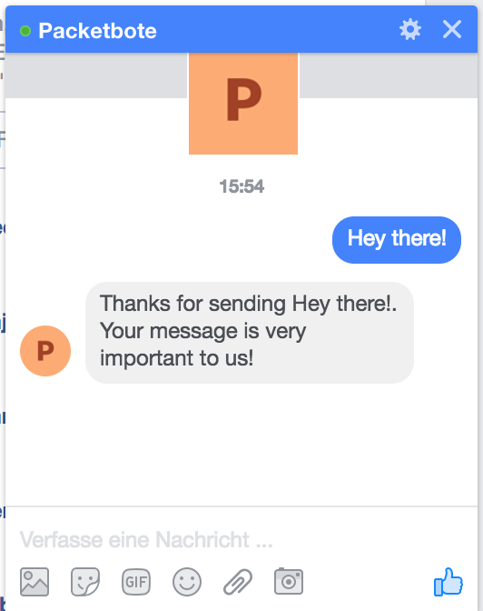

# POC - Facebook Chatbot using AWS Lambda in 5 Minutes

## Prerequisites
* Facebook Account
* Facebook Developer Account
* [Setup Facebook Page and App](../setup_facebook)

* Node.js
* Claudia.js

* AWS Account
  * Permission "Lambda function"
  * Permission "API Gateway endpoints
  * Permission "IAM Roles"

## Hello World Bot
The Step-by-Step instructions is loosely based on the linked tutorial: https://claudiajs.com/tutorials/hello-world-chatbot.html

## Step-by-Step Instructions

### Implement the Bot
```javascript
var botBuilder = require('claudia-bot-builder');
module.exports = botBuilder(function (request) {
	return 'Thank for sending ' + request.text + '. Your message is very important to us!'
}, {platforms: ['facebook']}
```

### Set up AWS infrastructure
`$ claudia create --region eu-central-1 --api-module bot`

Using this command the AWS infrastructure is set up. Additionally, ClaudiaJS creates a file called claudia.js with the following content (example).
```json
{
  "lambda": {
    "role": "hello-facebook-executor",
    "name": "hello-facebook",
    "region": "eu-central-1"
  },
  "api": {
    "id": "p2y7a0ug38",
    "module": "bot"
  }
}
```

### Configure the Bot
`$ claudia update --configure-fb-bot`

This command updates the infrastructure and lambda (if needed). Additionally, it stores the Access Token and App Secret for further communication. Both must be provided to this command when asked for. In return, it shows the Callback-URL und Verification Token required in the next step.

### Create a Webhook
Now, we need to connect the app to AWS and the page. Therefore, we add a Webhook where incoming messages are forwarded to.


A click on  "Webhooks einrichten" opens a popup to define the Callback-URL and the Verification Token for the Webhook. Both is obtained from the previous step.


Finally, we must define a page from which the app should receive notifications.


### Test the Bot
Um als Ersteller/Verwalter der Seite eine Nachricht zu senden bewegt man den Curser über den Button "Nachricht senden". Im dann erscheinenden Popup-Menü klickt man auf "Button testen". Wenn man nicht Ersteller/Verwalter der Seite ist kann man auch direkt auf den Button klicken. Allerdings muss man dann in der App als Testuser freigeschaltet sein, solange die App nicht "live" ist und sich im Entwicklermodus befindet.


After sending an arbitrary message, the bot responds instantaneously.

