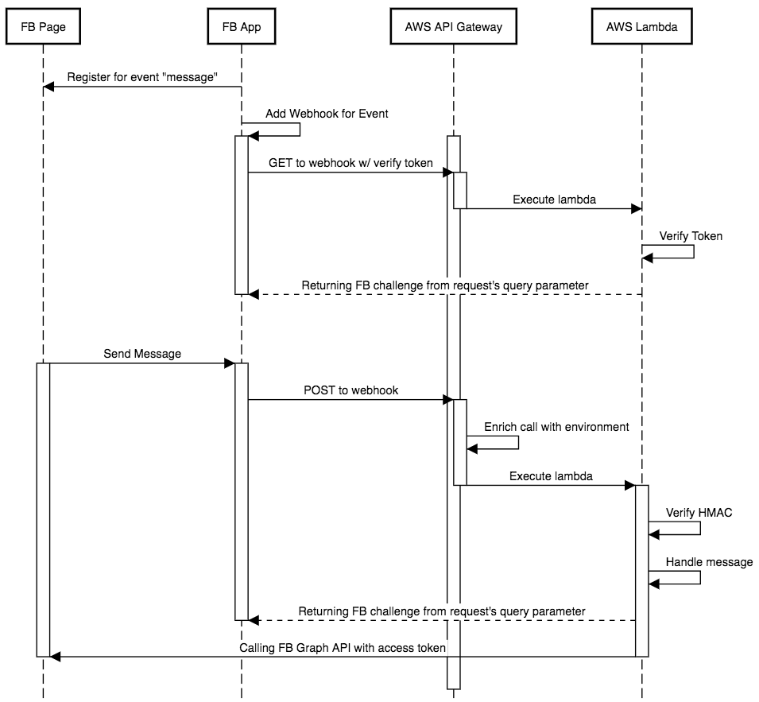

# Facebook chatbot basics

The following concepts are essential in order to understand how Facebook chatbots work. Claudia-bot-builder abstracts most of these processes for us, however we implemented it a basic chatbot by hand to understand and demonstrate these concepts.

## Content

- [Request flow](#request-flow)
- [Token verification](#token-verification)
- [Message signature validation](#message-signature-validation)

## Request flow

There are three separable processes:

1. At the Facebook app register for the event "message" at the Facebook page.
2. Add a webhook which you want to be called on the message event and verify the attached token. Verify token at your chatbot and return Facebook challenge.
3. Process message to Facebook page and call Facebook Graph API with response.



## Token verification

In order to ensure only authorized user can use your webhook, Facebook asks you for a verify token, when registering a new webhook. You need to take care of the verification of this token by your own.
When registering a new webhook, Facebook makes a GET call to your webhook, passing the verify token provided by the user.

```javascript
/**
 * This function gets called on the default endpoint's GET call, when the chatbot framework gets connected to Facebook via it's developer console initially
 * It verifies that the send verify token matches the given verify token
 * @param {Object} req aws lambda request object
 * @returns {Number|null} Returns a the request's hub challenge as Number or null, if the passed verify token does not match
 */
const initialFacebookConnectionHandler = req => {
    console.log('running initialFacebookConnectionHandler')

    if(objectPath.get(req, ['queryString', 'hub.verify_token']) === objectPath.get(req, 'env.facebook_verify_token')) {
        console.log('Passed validation')
        return parseInt(req.queryString['hub.challenge'])
    }

    console.log('Did not passed validation')
    return new api.ApiResponse('Did not passed validation', {'Content-Type': 'text/plain'}, 400)
}
```

`req.env.facebook_verify_token` is available once you added the token as AWS API Gateway stage environment variable, as [described above](#deploy-environment-variables-to-aws). Make sure to pass the previously created validation token, when adding webhooks. Facebook will add the verify token as query parameter `hub.verify_token`.
Return the challenge Facebook provides as query parameter `hub.challenge`, if validation passed.


## Message signature validation

To make sure each call is made by your application and not modified by anybody else, Facebook provides a hash of the message body, created with your app secret. Make sure to check the message's integrity!

```javascript
/**
 * Calculates hash by given algorithm and compares calculated by given signature
 * @param {String} signatureHeader Header as sent by Facebook containing hashing algorithm and hash, something like "sha1=alskjfaösekjf"
 * @param {String} secret Facebook app secret
 * @param {String} rawBody Request body to calculate hash
 */
const _checkMessageIntegrity = (signatureHeader, secret, rawBody) => {
    const [algorithm, givenSignature] = signatureHeader.split('=')
    const calculatedSignature = crypto.createHmac(algorithm, secret).update(rawBody).digest('hex')
    // Compare strings with tsscmp to prevent timing attacks: https://codahale.com/a-lesson-in-timing-attacks/
    return tsscmp(calculatedSignature, givenSignature)
}
```
